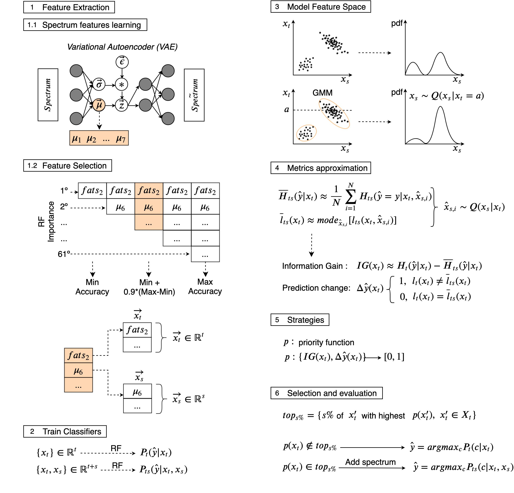

# An-Information-Theory-Approach-On-deciding-Spectroscopic-follow-ups

Classification and characterization of variable phenomena and transient phenomena are critical for astrophysics and cosmology. These objects are commonly studied using photometric time series or spectroscopic data. Given that many ongoing and future surveys are in time-domain and given that adding spectra provide further insights but requires more observational resources, it would be valuable to know which objects should we prioritize to have spectrum in addition to time series. We propose a methodology in a probabilistic setting that determines a-priory which objects are worth taking spectrum to obtain better insights, where we focus “insight” as the type of the object (classification). Objects for which we query its spectrum are reclassified using their full spectrum information. We first train two classifiers, one that uses photometric data and another that uses photometric and spectroscopic data together. Then for each photometric object we estimate the probability of each possible spectrum outcome. We combine these models in various probabilistic frameworks (strategies) which are used to guide the selection of follow up observations. The best strategy depends on the intended use, whether it is getting more confidence or accuracy. For a given number of candidate objects (127, equal to $5\%$ of the dataset) for taking spectra, we improve 37\% class prediction accuracy as opposed to 20$\%$ of a non-naive (non-random) best base-line strategy. Our approach provides a general framework for follow-up strategies and can be extended beyond classification and to include other forms of follow-ups beyond spectroscopy.

[Full article access](https://iopscience.iop.org/article/10.3847/1538-3881/ab557d)

**Keywords**: Computational methods (1965); Astronomy data analysis (1858); Astrostatistics tools (1887); Variable stars (1761); Gaussian Mixture Model; Information Theory

<b>Figure 1. Methodology overview. </b>
